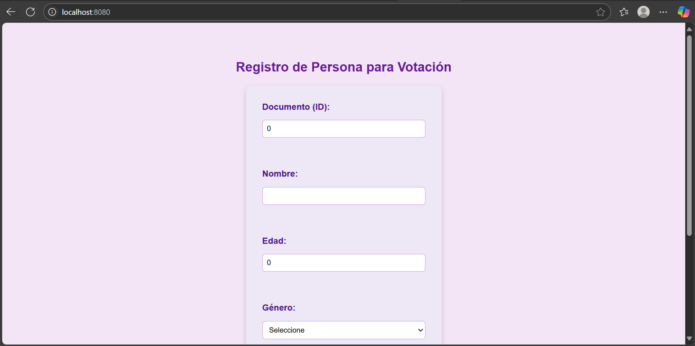
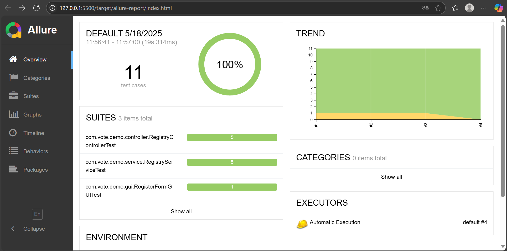
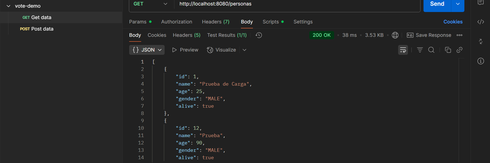
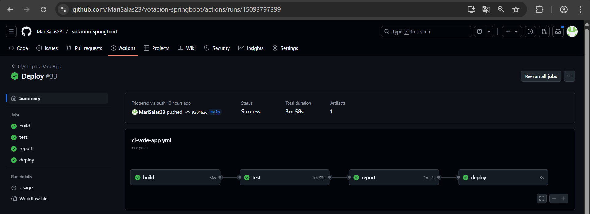
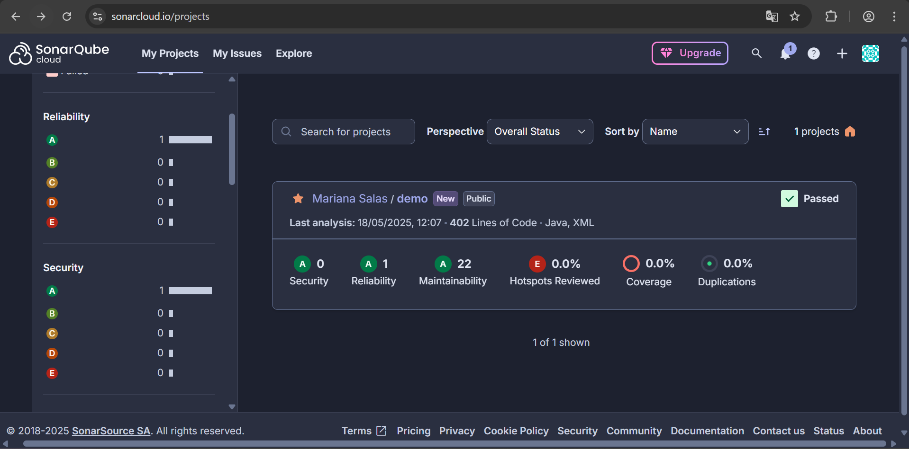

# **VoxPop - Monitoring Tutorial**

* Katherin Juliana Moreno Carvajal
* Mariana Salas Gutiérrez
* Santiago Navarro Cuy

# Construcción de Software

## Descripción del Desarrollo del Software 

Se implementa una arquitectura monolítica, donde todos los componentes del sistema, incluyendo la interfaz de usuario, la lógica de negocio y el acceso a datos, están integrados en una única aplicación desplegable. Esta arquitectura permite una integración sencilla de todos los componentes, lo que facilita el desarrollo, la depuración y el despliegue. Al mantener todo en un solo módulo, se reduce la complejidad de configuración y orquestación, lo cual resulta ideal para equipos pequeños o en entornos académicos.

Respecto al patrón de diseño, se implementa el patrón de diseño DAO (Data Access Object) para separar claramente la lógica de acceso a la base de datos del resto de la aplicación de la siguiente manera:
- **PersonDAO.java:** Encapsula toda la lógica de persistencia en SQLite, incluyendo inserción, consulta y verificación de personas mediante SQL.
- **RegistryService.java:** Aplica reglas de validación sobre los datos (edad, nombre, existencia previa, estado de vida) y delega las operaciones de base de datos al DAO. Esto permite mantener el código modular, reutilizable y fácil de probar.

Finalmente, acerca del patrón arquitectónico seleccionado, el patrón arquitectónico MVC (Modelo - Vista - Controlador) organiza la estructura del proyecto en tres capas bien definidas:
- **Modelo:** Representado por clases como Person, Gender y RegisterResult, que contienen los datos del dominio.
- **Vista:** Construida con Thymeleaf para mostrar formularios e interfaces HTML al usuario.
- **Controlador:** Como RegistryController, que gestiona las peticiones HTTP y conecta la vista con la lógica de negocio.

---

## Estructura del Proyecto
La estructura del proyecto sigue el estándar de **Maven** y **Spring Boot**, también utilizando **Docker**:

```
demo
├── .gitignore                          # Archivos y carpetas que Git debe ignorar
├── render.yaml                         # Configuración de despliegue en Render
├── .github
│   └── workflows
│       └── ci-vote-app.yml             # Workflow de GitHub Actions para CI/CD
├── .mvn
│   └── maven-wrapper.properties        # Configuración del wrapper de Maven
├── docker-compose.yml                  # Definición de contenedores (Selenium, SonarQube, etc.)
├── pom.xml                             # Configuración del proyecto Maven (dependencias, plugins, etc.)
├── personas.db                         # Base de datos SQLite local
├── README.md                           # Documentación del proyecto
├── vercel.json                         # Configuración para despliegue en Vercel (opcional)
├── src
│   ├── main
│   │   ├── java/com/vote/demo
│   │   │   ├── config
│   │   │   │   └── DatabaseInitializer.java     # Inicializa la base de datos si no existe
│   │   │   ├── controller
│   │   │   │   └── RegistryController.java      # Controlador principal de endpoints de registro
│   │   │   ├── dao
│   │   │   │   └── PersonDAO.java               # Acceso a la base de datos (DAO)
│   │   │   ├── model
│   │   │   │   ├── Gender.java                  # Enum para género
│   │   │   │   ├── Person.java                  # Clase modelo que representa una persona
│   │   │   │   └── RegisterResult.java          # Clase modelo para resultados del registro
│   │   │   ├── service
│   │   │   │   ├── RegistryService.java         # Servicio que contiene la lógica de validación
│   │   │   │   └── rules                        # Reglas específicas de validación
│   │   │   │       ├── AgeRule.java             # Regla de validación por edad
│   │   │   │       ├── AliveRule.java           # Regla de validación por estado de vida
│   │   │   │       └── ValidationRule.java      # Interfaz común para todas las reglas
│   │   │   └── DemoApplication.java             # Clase principal de la aplicación Spring Boot
│   │   └── resources
│   │       ├── application.properties           # Configuración general de Spring Boot
│   │       ├── schema.sql                       # Script SQL para generar estructura de la base de datos
│   │       └── static
│   │           └── css
│   │               └── form.html                # Vista HTML con formulario de registro (Thymeleaf o estático)
│
│   └── test/java/com/vote/demo
│       ├── carga
│       │   ├── results.jtl                      # Resultado de prueba de carga (JMeter)
│       │   └── HTTP Request.jmx                 # Plan de prueba de carga JMeter
│       ├── controller
│       │   └── RegistryControllerTest.java      # Pruebas unitarias del controlador de registro
│       ├── gui
│       │   └── RegisterFormGUITest.java         # Pruebas automatizadas GUI con Selenium
│       ├── postman
│       │   └── vote-demo.postman_collection.json # Colección Postman para pruebas API automatizadas con Newman
│       └── service
│           └── HTTP Request.jmx                 # Plan de prueba en carpeta de servicios
└── target                                       # Archivos generados automáticamente por Maven tras compilación

```

---

## Dependencias Utilizadas

Este proyecto utiliza dependencias adicionales que deban ser definidas en el archivo **pom.xml**:
- **Spring Boot Starter Web:** Para construir aplicaciones web REST con Spring MVC.
- **Spring Boot Starter Thymeleaf:** Para el renderizado de vistas HTML usando el motor de plantillas Thymeleaf.
- **Spring Boot Starter Test:** Incluye JUnit, Hamcrest, Mockito y más para pruebas unitarias y de integración.
- **SQLite JDBC:** Conector JDBC para trabajar con bases de datos SQLite.
- **Selenium Java:** Para automatización de pruebas GUI en navegadores.
- **Selenium Remote Driver:** Permite la ejecución remota de pruebas Selenium.
- **Selenium Support:** Funciones adicionales y utilitarias para pruebas Selenium.
- **Allure JUnit 5:** Adaptador para generar reportes de prueba con Allure desde JUnit 5.

---

## Despliegue en Render

[Link](https://votacion-springboot.onrender.com)

## Instrucciones de Instalación

1. **Instalar Docker:**
[Descargar Docker](https://docs.docker.com/desktop/setup/install/windows-install/)
   
2. **Clonar el repositorio:**
```Powershell
git clone https://github.com/MariSalas23/votacion-springboot.git
```

3. **Compilar el proyecto:**
```Powershell
cd C:\Users\marim\PARCIAL 3\demo> # Cambiar a la ubicación del repositorio clonado, donde se encuentra el archivo: docker-compose.yml
docker-compose up -d
docker ps
```

4. **Correr el proyecto:**
```Powershell
mvn spring-boot:run
```

5. **Correr pruebas:**
```Powershell
mvn verify
```

6. **Abrir el proyecto:**
```Navegador
http://localhost:8080/
```

7. **Abrir Allure Report:**
```Navegador
http://127.0.0.1:5500/target/allure-report/index.html
```

---

## Ejemplo de Ejecución

Al ingresar los comandos establecidos para Docker en el apartado anterior, deberías ver la siguiente salida:

```Powershell
CONTAINER ID   IMAGE                                COMMAND                  CREATED        STATUS                   PORTS                              NAMES
ed39d4d58a1a   frankescobar/allure-docker-service   "/bin/sh -c '$ROOT/r…"   11 hours ago   Up 11 hours (healthy)    4040/tcp, 0.0.0.0:5051->5050/tcp   unruffled_lamarrfc30fe4fe42b   frankescobar/allure-docker-service   "/bin/sh -c '$ROOT/r…"   11 hours ago   Up 9 minutes (healthy)   4040/tcp, 0.0.0.0:5050->5050/tcp   allure-report   
a9d5aa5e1c89   sonarqube:latest                     "/opt/sonarqube/dock…"   14 hours ago   Up 9 minutes             0.0.0.0:9000->9000/tcp             sonarqube       
56ecf3f428c4   postgres:latest                      "docker-entrypoint.s…"   14 hours ago   Up 9 minutes             5432/tcp                           postgres        
217215fb74a5   selenium/node-chrome:4.21.0          "/opt/bin/entry_poin…"   19 hours ago   Up 9 minutes             5900/tcp                           demo-chrome-1   
c3eec66b86ff   selenium/hub:4.21.0                  "/opt/bin/entry_poin…"   19 hours ago   Up 9 minutes             0.0.0.0:4442-4444->4442-4444/tcp   selenium-hub
```

Al ejecutar el programa, deberías ver la siguiente salida:

```Powershell
[INFO] Scanning for projects...
[INFO] 
[INFO] ---------------------------< com.vote:demo >----------------------------
[INFO] Building demo 0.0.1-SNAPSHOT
[INFO]   from pom.xml
[INFO] --------------------------------[ jar ]---------------------------------
[WARNING] Parameter 'resultsOutputIsCSV' is unknown for plugin 'jmeter-maven-plugin:3.4.0:configure (configuration)'
[WARNING] Parameter 'resultLogFilename' is unknown for plugin 'jmeter-maven-plugin:3.4.0:configure (configuration)'
[WARNING] Parameter 'skip' is unknown for plugin 'jmeter-maven-plugin:3.4.0:configure (configuration)'
[WARNING] Parameter 'logRootDirectory' is unknown for plugin 'jmeter-maven-plugin:3.4.0:configure (configuration)'
[WARNING] Parameter 'jmeterLogFilename' is unknown for plugin 'jmeter-maven-plugin:3.4.0:configure (configuration)'
[INFO]
[INFO] >>> spring-boot:3.4.5:run (default-cli) > test-compile @ demo >>>
[INFO] 
[INFO] --- resources:3.3.1:resources (default-resources) @ demo ---
[INFO] Copying 1 resource from src\main\resources to target\classes
[INFO] Copying 3 resources from src\main\resources to target\classes
[INFO]
[INFO] --- compiler:3.13.0:compile (default-compile) @ demo ---
[INFO] Nothing to compile - all classes are up to date.
[INFO]
[INFO] --- jmeter:3.4.0:configure (configuration) @ demo ---
[INFO]  
[INFO] -------------------------------------------------------
[INFO] C O N F I G U R I N G    J M E T E R
[INFO] -------------------------------------------------------
[INFO]
[INFO] Creating test configuration for execution ID: configuration
[INFO] Building JMeter directory structure...
[INFO] Generating JSON Test config...
[INFO] Configuring JMeter artifacts...
[INFO] Populating JMeter directory...
[INFO] Copying extensions to C:\Users\marim\PARCIAL 3\demo\target\2f0b36d2-867f-4858-b162-837454bed83e\jmeter\lib\ext 
Downloading dependencies: true
[INFO] Copying junit libraries to C:\Users\marim\PARCIAL 3\demo\target\2f0b36d2-867f-4858-b162-837454bed83e\jmeter\lib\junit
Downloading dependencies: true
[INFO] Copying test plan libraries to C:\Users\marim\PARCIAL 3\demo\target\2f0b36d2-867f-4858-b162-837454bed83e\jmeter\lib
Downloading dependencies: true
[INFO] Configuring JMeter properties...
[INFO] 
[INFO] --- resources:3.3.1:testResources (default-testResources) @ demo ---
[INFO] skip non existing resourceDirectory C:\Users\marim\PARCIAL 3\demo\src\test\resources
[INFO]
[INFO] --- compiler:3.13.0:testCompile (default-testCompile) @ demo ---
[INFO] Nothing to compile - all classes are up to date.
[INFO]
[INFO] <<< spring-boot:3.4.5:run (default-cli) < test-compile @ demo <<<
[INFO]
[INFO]
[INFO] --- spring-boot:3.4.5:run (default-cli) @ demo ---
[INFO] Attaching agents: []

  .   ____          _            __ _ _
 /\\ / ___'_ __ _ _(_)_ __  __ _ \ \ \ \
( ( )\___ | '_ | '_| | '_ \/ _` | \ \ \ \
 \\/  ___)| |_)| | | | | || (_| |  ) ) ) )
  '  |____| .__|_| |_|_| |_\__, | / / / /
 =========|_|==============|___/=/_/_/_/

  :: Spring Boot ::                (v3.4.5)

2025-05-18T12:28:30.680-05:00  INFO 32580 --- [demo] [           main] com.vote.demo.DemoApplication            : Starting DemoApplication using Java 17.0.14 with PID 32580 (C:\Users\marim\PARCIAL 3\demo\target\classes started by marim in C:\Users\marim\PARCIAL 3\demo)
2025-05-18T12:28:30.683-05:00  INFO 32580 --- [demo] [           main] com.vote.demo.DemoApplication            : No active profile set, falling back to 1 default profile: "default"
2025-05-18T12:28:32.488-05:00  INFO 32580 --- [demo] [           main] o.s.b.w.embedded.tomcat.TomcatWebServer  : Tomcat initialized with port 8080 (http)
2025-05-18T12:28:32.524-05:00  INFO 32580 --- [demo] [           main] o.apache.catalina.core.StandardService   : Starting service [Tomcat]
2025-05-18T12:28:32.524-05:00  INFO 32580 --- [demo] [           main] o.apache.catalina.core.StandardEngine    : Starting Servlet engine: [Apache Tomcat/10.1.40]      
2025-05-18T12:28:32.693-05:00  INFO 32580 --- [demo] [           main] o.a.c.c.C.[Tomcat].[localhost].[/]       : Initializing Spring embedded WebApplicationContext
2025-05-18T12:28:32.699-05:00  INFO 32580 --- [demo] [           main] w.s.c.ServletWebServerApplicationContext : Root WebApplicationContext: initialization completed in 1898 ms
? Tabla 'person' verificada o creada en votantes.db
2025-05-18T12:28:33.655-05:00  INFO 32580 --- [demo] [           main] o.s.b.w.embedded.tomcat.TomcatWebServer  : Tomcat started on port 8080 (http) with context path '/'
2025-05-18T12:28:33.670-05:00  INFO 32580 --- [demo] [           main] com.vote.demo.DemoApplication            : Started DemoApplication in 3.906 seconds (process running for 4.681)
```

Al ingresar el comando establecidos para las pruebas, deberías ver la siguiente salida:

```Powershell
[INFO] ------------------------------------------------------------------------
[INFO] BUILD SUCCESS
[INFO] ------------------------------------------------------------------------
[INFO] Total time:  54.563 s
[INFO] Finished at: 2025-05-18T11:57:21-05:00
[INFO] ------------------------------------------------------------------------
[INFO] Total time:  54.563 s
[INFO] Finished at: 2025-05-18T11:57:21-05:00
[INFO] Finished at: 2025-05-18T11:57:21-05:00
[INFO] ------------------------------------------------------------------------
```

Al abrir los respectivos localhost, deberían aparecer las siguientes salidas: 




## Pruebas

### Pruebas Unitarias

Estas pruebas se realizaron con JUnit para garantizar que los componentes funcionen correctamente
a nivel de unidad. A continuación, se muestran los resultados que se deberían ver de las pruebas.

```Powershell
[INFO] -------------------------------------------------------
[INFO]  T E S T S
[INFO] -------------------------------------------------------
[INFO] Tests run: 1, Failures: 0, Errors: 0, Skipped: 0, Time elapsed: 16.576 s - in com.vote.demo.gui.RegisterFormGUITest
[INFO] Running com.vote.demo.service.RegistryServiceTest
[INFO] Tests run: 5, Failures: 0, Errors: 0, Skipped: 0, Time elapsed: 0.06 s - in com.vote.demo.service.RegistryServiceTest
```

### Pruebas Autónomas

Estas pruebas se realizaron con Mockito para simular las dependencias externas. A continuación, se muestran los resultados que se deberían ver de las pruebas.

```Powershell
[INFO] -------------------------------------------------------
[INFO]  T E S T S
[INFO] -------------------------------------------------------
[INFO] Running com.vote.demo.controller.RegistryControllerTest
OpenJDK 64-Bit Server VM warning: Sharing is only supported for boot loader classes because bootstrap classpath has been appended
[INFO] Tests run: 5, Failures: 0, Errors: 0, Skipped: 0, Time elapsed: 2.788 s - in com.vote.demo.controller.RegistryControllerTest
```

### Pruebas de Carga

Estas pruebas se realizaron con Apache JMeter para simular cargas de trabajo realistas y medir el rendimiento del sistema bajo diferentes condiciones. A continuación, se muestran los resultados que se deberían ver de las pruebas en el archivo 20250518-HTTP Request.csv, generado en la ruta \target\jmeter\results\20250518-HTTP Request.csv.

```20250518-HTTP Request.csv
timeStamp,elapsed,label,responseCode,responseMessage,threadName,dataType,success,failureMessage,bytes,sentBytes,grpThreads,allThreads,URL,Latency,IdleTime,Connect
1747587426188,225,HTTP Request,200,,Thread Group 1-47,text,true,,1758,265,76,76,http://localhost:8080/register,220,0,148
1747587426190,223,HTTP Request,200,,Thread Group 1-41,text,true,,1758,265,76,76,http://localhost:8080/register,215,0,150
1747587426190,223,HTTP Request,200,,Thread Group 1-13,text,true,,1758,265,75,75,http://localhost:8080/register,220,0,153
1747587426190,223,HTTP Request,200,,Thread Group 1-25,text,true,,1758,265,75,75,http://localhost:8080/register,220,0,134
1747587426335,78,HTTP Request,200,,Thread Group 1-71,text,true,,1758,265,75,75,http://localhost:8080/register,71,0,5
1747587426188,225,HTTP Request,200,,Thread Group 1-3,text,true,,1758,265,75,75,http://localhost:8080/register,218,0,155
1747587426190,222,HTTP Request,200,,Thread Group 1-35,text,true,,1758,265,75,75,http://localhost:8080/register,215,0,155
1747587426233,180,HTTP Request,200,,Thread Group 1-58,text,true,,1758,265,75,75,http://localhost:8080/register,171,0,88
1747587426190,222,HTTP Request,200,,Thread Group 1-34,text,true,,1758,265,75,75,http://localhost:8080/register,213,0,129
```
### Pruebas de Interfaz Gráfica (GUI)

Estas pruebas se realizaron con Selenium para automatizar pruebas de la interfaz gráfica, verificando la correcta interacción del usuario con la aplicación. A continuación, se muestran los resultados que se deberían ver de las pruebas.

```Powershell
[INFO] -------------------------------------------------------
[INFO]  T E S T S
[INFO] -------------------------------------------------------
[INFO] Running com.vote.demo.gui.RegisterFormGUITest
may 18, 2025 11:56:43 A. M. org.openqa.selenium.remote.tracing.opentelemetry.OpenTelemetryTracer createTracer
INFORMACIÓN: Using OpenTelemetry for tracing
Mensaje recibido: Registro exitoso. ¡Puede votar!
[INFO] Tests run: 1, Failures: 0, Errors: 0, Skipped: 0, Time elapsed: 16.576 s - in com.vote.demo.gui.RegisterFormGUITest
[INFO] 
[INFO] Results:
[INFO]
[INFO] Tests run: 11, Failures: 0, Errors: 0, Skipped: 0
```

### Pruebas de API

Estas pruebas se realizaron con Newman y Postman para probar sus APIs y servicios REST. A continuación, se muestran los resultados que se deberían ver de las pruebas.

```Powershell
[INFO] --- exec:3.1.0:exec (postman-tests) @ demo ---
newman

vote-demo

 Get data
  GET http://host.docker.internal:8080/personas [200 OK, 3.61kB, 189ms]
  Ô£ô  Status code is 200

 Post data
  POST http://host.docker.internal:8080/register [200 OK, 1.75kB, 29ms]
  Ô£ô  Successful POST request
```

Utilizando la interfaz gráfica de Postman se vería así:



## Integración Continua y Despliegue Continuo (CI/CD)

Se configura un pipeline de CI/CD que ejecuta automáticamentelas pruebas cada vez que se realice un cambio en el código y que automatiza el despliegue del sistema, por medio de GitHub Actions en este repositorio. Este se encuentra dividido de la siguiente manera:

- **build:** Compilar la app y verificar su ejecución.
- **test:** Ejecutar pruebas unitarias y de rendimiento. Específicamente, ejecuta pruebas unitarias, autónomas y de carga, copiando los logs de JMeter.
- **report:** Genera reportes y análisis estático del código con SonarCloud y Allure Report.
- **deploy:** Desplegar automáticamente la app en Render.

Se muestra la imagen con la evidencia de la correcta configuración del pipeline.



## Análisis de Calidad de Código 

Para mantener la calidad del código, se integra SonarCloud en el pipeline de CI/CD, para realizar análisis de calidad del código, cobertura y detección de vulnerabilidades, dando como resultado la siguiente imagen.



## Reporte de Pruebas

Para generar informes visuales de las pruebas realizadas, se utiliza Allure Report como se describe en la *instrucción 7*. 

---
